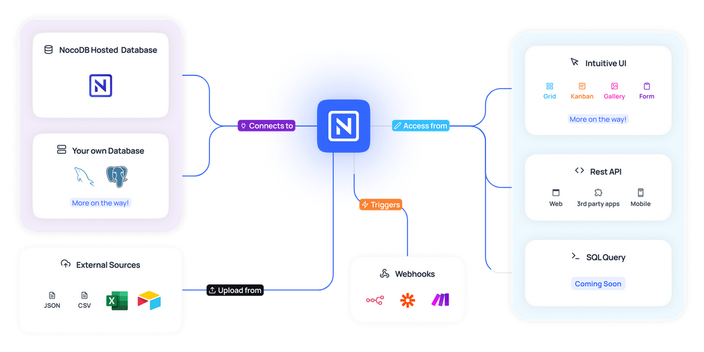
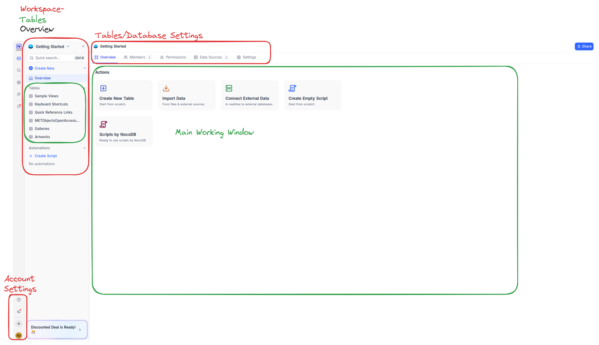

:::::::::::::::::::::::::::::::::::::: questions

- What is NocoDB?
- How does NocoDB connect Spreadsheets with a relational database?
- How can i use NocoDB?

::::::::::::::::::::::::::::::::::::::::::::::::

::::::::::::::::::::::::::::::::::::: objectives

- Create a new Base and a table within NocoDB
- Add, rename, and configure fields (columns) in a table.
- Choose appropriate data types for different kinds of information.

::::::::::::::::::::::::::::::::::::::::::::::::

As mentioned earlier, NocoDB is a **no-code database** platform that combines the ease of use of a spreadsheet with the power of a relational database. In simple terms, NocoDB provides a web-based interface built on top of a traditional relational database like PostgreSQL or MySQL. The great thing about NocoDB is that you don’t need to understand the underlying database technology to use it, one of the key benefits of no-code tools.

With NocoDB, you can create and manage databases through a simple, user-friendly interface, bypassing the need for complex programming. This means that tasks like organizing data, creating tables, and running queries, which would normally require coding, can now be done directly through the web interface. Whether you're building a database from scratch or working with an existing one, NocoDB makes it easy to interact with your data.

In this tutorial, we'll focus on using the online version of NocoDB, which you can access [here](https://app.nocodb.com/). However, you also have the option to host your own version of NocoDB, either on your local machine or on a server.

## Layout

The first step to getting started with NocoDB is to create an account. Once you’ve registered and logged in, you’ll be taken to the **NocoDB homepage**, where you can begin exploring its features.

On the left side of the interface, you’ll find the **main navigation menu**, which gives you access to several important options:

- **Overview** of workspaces and tables
- **General settings** to manage your NocoDB account
- **Team settings** for collaborating with others
- **Automations** to automate different tasks
- The option to **create a new Base**

In NocoDB, a **Base** is like a database, it’s a container that holds your tables and provides additional features for organizing and managing your data. 

When you first sign up, NocoDB will automatically create a sample Base called **Getting Started**. This Base opens by default and helps you get familiar with the platform’s core features.

The central area of the screen is where you’ll do most of your work. NocoDB follows a simple structure: at the top level, you create a **Workspace**, inside this Workspace you have **Bases** and within a Base, you can add one or more **tables**. Tables are where your actual data lives, and you can customize them with **Views** to display and filter your data in different ways. We’ll dive into Views in more detail later.

## Creating a Base

Instead of working with the sample Base, let’s create our own so we can explore NocoDB’s features from scratch.

To get started, click on **Create Base**, give your new Base a name (e.g., `Sample_base`), and click **create_base** to confirm. You’ve now created an empty Base, ready to be filled with data.

There are several ways to populate a Base in NocoDB:

- **Create a new table manually**
- **Import data from a file** (such as CSV or Excel)
- **Connect to an external data source**

For this exercise, let’s manually create a new table. Click on **Create New Table**, give the table a name (e.g., `Art_Collection`), and you’ll be taken to an empty, spreadsheet-like interface where you can define the structure of your table.

At the same time, you’ll notice that your newly created table now appears under your Base in the left-hand menu. This gives you an easy way to navigate between your tables.

If you want to add more tables later on, simply hover over the Base name in the left sidebar, and a **plus symbol** will appear, click it to add another table.

## Data Fields

Now that we’ve created our table, we need to define its structure by adding fields. Fields are the columns of your table. Each one represents a specific kind of information you want to store for every row (or record) in the table.
When you first create a table, NocoDB automatically adds a field called Title. This is a default field and cannot be deleted, but you can rename it and choose a different data type to make it fit your needs:

1. Locate the Title column in your table.
2. Click on the small arrow next to the field name Title.
3. From the dropdown menu, select Edit field.

In the dialog box that opens, you can:

- Change the Field Name (for example, rename it to Artwork Title).
- Select a Field Type from the list (e.g., Single line text, Number, etc.).
- Optionally, add a default value for the whole column.
- Optionally, add a Description to explain what this field is for, helpful when collaborating with others.
- Click Save to apply your changes.

#### Adding a New Field

To add more fields:

1. Hover your mouse over the header row in the table, to the right of your existing fields.
2. Click on the plus icon (+) that appears.
3. In the dialog that opens, enter the Field Name (e.g., Artist).
4. Choose the appropriate Field Type.
5. Click Create Column to add the field to your table.

You can repeat this process to add as many fields as you need.

::::::::::::::::::::::::::::::::::::: callout

### Callout: Data Field Types

When creating or editing a field, NocoDB offers a range of data types to choose from. Selecting the right type helps keep your data consistent, makes it easier to sort or filter, and ensures others know what kind of input is expected.

Here are some of the most commonly used field types:

+ Single line text: For short text entries like names or titles.
+ Long text: For longer descriptions or notes.
+ Number: For any numerical values. You can define decimal places and minimum/maximum ranges.
+ Date: For calendar dates. You can also include time if needed.
+ Single/Multi Select: Lets you define a fixed set of options from which users can choose. Useful for categories like Genre, Location, or Status.
+ Checkbox: A simple yes/no or true/false value.
+ Email / Phone / URL: Special text types that validate the input (e.g., only valid email addresses can be entered).
+ Formula: Calculates values based on other fields, similar to formulas in spreadsheet software.

::::::::::::::::::::::::::::::::::::::::::::::::

::::::::::::::::::::::::::::::::::::: challenge

### Exercise: Creating your own table

Now that you’ve learned how to create a Base and add tables and fields, it’s time to apply what you’ve learned.

1. Look at the example from the previous episode.
2. Create a new, empty table for it, either in your existing Base or in a new one.
3. Choose at least 5 informations and create fields using different field types (e.g. Text, Number, Date, Single select, Checkbox). The normal form does not have to be taken into account initially. Simply select the columns you like
4. Create one field for an image of the artworks
5. Name your fields based on what kind of data you expect (e.g. Title, Author, Year, etc.).
6. Try editing a field type or renaming a field.
7. Explore freely: test options, click around, and get familiar with the interface.

You don’t need to enter data yet, just focus on setting up the table structure.

::::::::::::::::::::::::::::::::::::::::::::::::

#### Adding a New Relation

Until now we used NocoDB only as a spreadsheet tool. To connect tables with each other, we need the field type **Link**. This is useful 

To add a relation:

1. Add a new field by clicking the plus icon (+) in your table header.
2. In the dialog, select **Links** as the Field Type.
3. Choose the table you want to link to (for example, linking an Artwork to an Artist).
4. Set the relation type (see below).

::::::::::::::::::::::::::::::::::::: callout

### Callout: Relational Types

- **One to One**: Each record in Table A can be linked to only one record in Table B, and vice versa. Example: Each artwork has exactly one location, and each location is assigned to only one artwork.
- **Has Many (One to Many)**: Each record in Table A can be linked to multiple records in Table B, but each record in Table B links back to only one record in Table A. Example: One artist can have many artworks, but each artwork has only one artist.
- **Many to Many**: Records in Table A can be linked to multiple records in Table B, and vice versa. Example: An artwork can be displayed in multiple exhibitions, and each exhibition can include multiple artworks.

::::::::::::::::::::::::::::::::::::::::::::::::

5. Click **Create Column** to add the relation field.

Once created, you can select records from the linked table directly within your table. This makes it easy to reference related data without duplicating information and gives you the opportunity to create a relational database.

##### Relation Types

When creating a link, you have to define how records in your tables relate to each other:

Choosing the correct relation type helps you accurately model your data and ensures that NocoDB enforces the right constraints when linking records.

With the Link field and relation types, you can build complex, interconnected databases in NocoDB—without writing

::::::::::::::::::::::::::::::::::::: keypoints

+ In NocoDB, you create tables and add fields (columns) with different data types (e.g., text, number, date).
+ Fields of type Link allow you to connect tables and create relationships between records.
+ When adding a Link field, you can choose the relation type: One to One, One to Many (Has Many), or Many to Many.

::::::::::::::::::::::::::::::::::::::::::::::::

