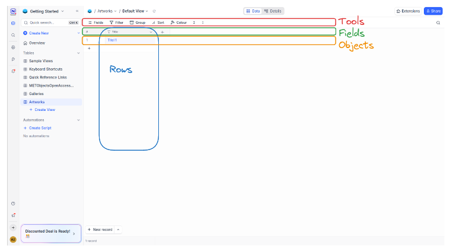

:::::::::::::::::::::::::::::::::::::: questions

- How do I import data in NocoDB?
- How do I filter data?
- What kinds of analysis are supported in NocoDB?

::::::::::::::::::::::::::::::::::::::::::::::::

::::::::::::::::::::::::::::::::::::: objectives

- import data from csv
- explore foreign data with filter and sort functions

::::::::::::::::::::::::::::::::::::::::::::::::

In this episode, we’ll take the first steps toward exploring and analyzing data in NocoDB using two tools: **Filters** and **Sorting**. Before we do that, we need to import some data to work with.

## Importing a CSV File

We’ll begin by importing a dataset in CSV format. CSV (Comma-Separated Values) is a common file format used to store tabular data. If not already done, please download the data [here](/data/METObjectsOpenAccess.csv).

1. Open the Base where you want to import the data, in our case it can be the *Sample_base*.  

2. Inside the Base, click on **Import Data**.

3. In the dialog that appears, select the **CSV** option. (NocoDB gives you the oppurtunity to use different file formats and adapt these to a spreadsheet)

4. Choose your CSV file by either:
   - Clicking **Upload File** and selecting the file from your computer, or
   - Dragging and dropping the file into the upload area.
   - The Field of The Dropdown Menu should be **UTF-8**, if not, open the dropdown and select it.

5. Click **Import files**

6. Now you can choose which columns you want to import. Leave everything checked and click **Import**

Your CSV file is now imported into NocoDB and appears as a new table. You should see your data in a spreadsheet-like view, ready to be cleaned and explored.

## Adjust Field Types

After importing data, it’s a good idea to review the **field types** for each column. NocoDB gives the Field Type "Single line text" after importing data, but this can lead to different problems and limitations. Choosing the right field type helps NocoDB understand how to handle your data, and unlocks useful features for filtering, sorting, and analysing.

::::::::::::::::::::::::::::::::::::: challenge

### Exercise: Changing field types

Change the field types of our table according to the data in each column. Which field types but single line text could be useful for the **Department** or **Medium** column, where the number of different entries are limited?

::::::::::::::::::::::::::::::::::::::::::::::::

Taking time to set this up now will make exploring and further collecting of data much easier.

## Filtering Data

Filters allow you to narrow down the data in your table, that you only see rows that match certain conditions. This is especially helpful when working with large datasets or when you want to focus on a specific subset of records. It also gives you the opportunity to get a first impression of the data you have.

#### To apply a filter:

1. Click on the **Filter** icon (funnel symbol) at the toolbar.
2. A filter menu will appear. Here you can create only one filter or a filter group. For the beginning we want to create a single filter. Click on **Add filter**
3. First, you will see a field where you select a column to filter by, an operator to apply and a value to use for the filter. (Different field types will give you different operatos you can choose)

**Example:**  
Filter by `Year` → *greater than* → `1950`  
Filter by `Object Name` → *is equal* → `Print`

At this point at the latest, it becomes relevant that the correct data types are assigned to the fields, as these enable different operators for filtering. The operators **greater than** and **is equal**, for example, are only possible for numerical values.

## Grouping Data

Another useful feature for exploring data in NocoDB is **Grouping**. This allows you to organize your table into logical sections based on the values of a specific field. Grouping helps you quickly spot patterns, compare categories, and get a better overview of how your data is structured.

#### To group your data:

1. In the toolbar at the top, click on the **Group** icon.
2. Choose the **field** you want to group by, for example:
   - `Department`
   - `Culture`
   - `Medium`
   - `Accession Year`
3. NocoDB will automatically reorganize the view and display your records grouped by the selected field.

Each group can be Collapsed or expanded to hide or show its rows and to see the related entries. In a next step you can create a subgroup by doing the steps again. With this you can get an even better expression of your data. It also makes it possible to select only a certain part of the data for further analyses and to view partial data sets.

::::::::::::::::::::::::::::::::::::: callout

### Callout: Field Types and grouping

Grouping works especially well when your field is a **Single Select**, because the values are already clean and consistent. If you group by a free-text field, make sure the entries are standardized to avoid duplicate or inconsistent group names (e.g., "oil painting" vs. "Oil Painting").

::::::::::::::::::::::::::::::::::::::::::::::::

## Sorting Data

Sorting lets you change the order in which records appear, for example, to view the oldest items first or group similar values together.

#### To sort your data:

1. Click on the **Sort** icon from the toolbar.
2. Choose the **field** to sort by and select:
   - **Ascending** (A–Z or 0–9), or
   - **Descending** (Z–A or 9–0)
3. Add multiple sort levels if needed (e.g., by `Year` and then by `Artist`).

All in all, it can be said that good preparation of the data and selection of the correct field types is essential in order to be able to process the data efficiently in the next step. Well-prepared data enables efficient and targeted filtering, grouping and sorting of the data. All these functions combined make it possible to gain very detailed insights into large, confusing data.

::::::::::::::::::::::::::::::::::::: challenge

### Exercise: Exploring data

Use the Filter, Sort and Group functionality in NocoDB to answer the following questions:

- How many different departments are there and how many works of art are in each department?
- How many works of art were added to the Metropolitan Museum's collection after 1950?
- Do objects exist that contain one of the tags Women, Battles, Cats or Ships and are attributed to the ObjectName Print?

::::::::::::::::::::::::::::::::::::::::::::::::

::::::::::::::::::::::::::::::::::::: keypoints

- After importing a CSV file, review and adjust the field types for each column to ensure correct data handling.
- Use **Filters** to display only records that match specific conditions, making it easier to focus on relevant data.
- **Grouping** allows you to organize records by a chosen field, helping you spot patterns and compare categories.
- **Sorting** lets you change the order of records, for example by year or artist, to better analyze your data.
- Proper field types and data preparation are essential for efficient filtering, grouping, and sorting in NocoDB.

::::::::::::::::::::::::::::::::::::::::::::::::
